# Chart and Diagram Generator

## Overview

This skill provides comprehensive guidance for creating professional charts and diagrams using Mermaid and PlantUML. It covers flowcharts, sequence diagrams, class diagrams, architecture diagrams, ER diagrams, state machines, mindmaps, and various other diagram types for technical documentation.

## When to use this skill

**ALWAYS use this skill when the user mentions:**
- Creating flowcharts or process diagrams
- Generating UML diagrams
- Creating sequence diagrams
- Building architecture diagrams
- Creating ER diagrams or database schemas
- Generating class diagrams
- Creating state diagrams
- Building mindmaps or timelines

**Trigger phrases include:**
- "Create flowchart" / "建立流程圖"
- "Generate diagram" / "生成圖表"
- "Draw sequence diagram" / "畫時序圖"
- "Architecture diagram" / "架構圖"
- "UML diagram" / "UML圖"
- "ER diagram" / "實體關係圖"
- "Class diagram" / "類圖"
- "State diagram" / "狀態圖"

## How to use this skill

### Workflow Overview

This skill follows a systematic 3-step workflow:

1. **Identify Diagram Type** - Determine the appropriate diagram type for the use case
2. **Choose Tool** - Select Mermaid or PlantUML based on requirements
3. **Generate Diagram** - Create diagram code and render it

## Mermaid vs PlantUML

### When to Use Mermaid
- Markdown-friendly diagrams
- Quick, simple diagrams
- GitHub/GitLab documentation
- Web-based rendering
- Flowcharts, sequence diagrams, Gantt charts

### When to Use PlantUML
- Complex UML diagrams
- Detailed system architecture
- Standard UML compliance
- Advanced styling needs
- Enterprise documentation

## Mermaid Diagrams

### Flowchart

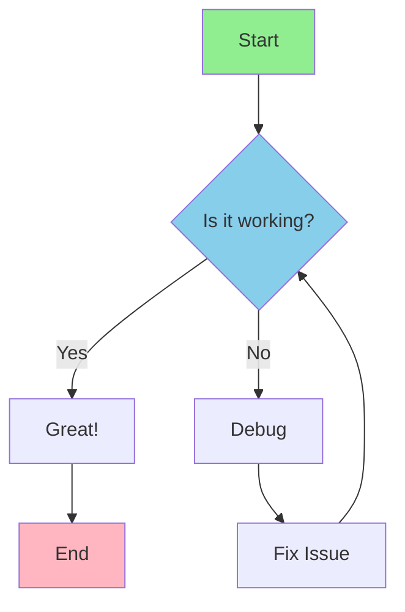

**Code:**
```
flowchart TD
    A[Start] --> B{Is it working?}
    B -->|Yes| C[Great!]
    B -->|No| D[Debug]
    D --> E[Fix Issue]
    E --> B
    C --> F[End]

    style A fill:#90EE90
    style F fill:#FFB6C1
    style B fill:#87CEEB
```

### Sequence Diagram

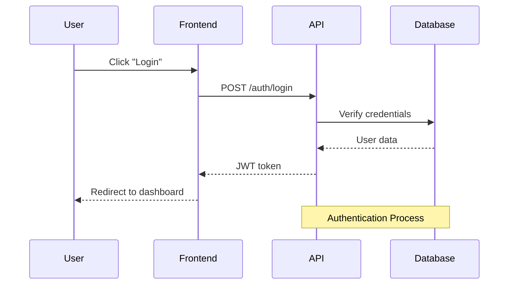

**Code:**
```
sequenceDiagram
    participant User
    participant Frontend
    participant API
    participant Database

    User->>Frontend: Click "Login"
    Frontend->>API: POST /auth/login
    API->>Database: Verify credentials
    Database-->>API: User data
    API-->>Frontend: JWT token
    Frontend-->>User: Redirect to dashboard

    Note over API,Database: Authentication Process
```

### Class Diagram

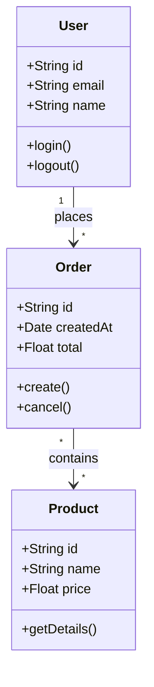

**Code:**
```
classDiagram
    class User {
        +String id
        +String email
        +String name
        +login()
        +logout()
    }

    class Order {
        +String id
        +Date createdAt
        +Float total
        +create()
        +cancel()
    }

    class Product {
        +String id
        +String name
        +Float price
        +getDetails()
    }

    User "1" --> "*" Order : places
    Order "*" --> "*" Product : contains
```

### State Diagram

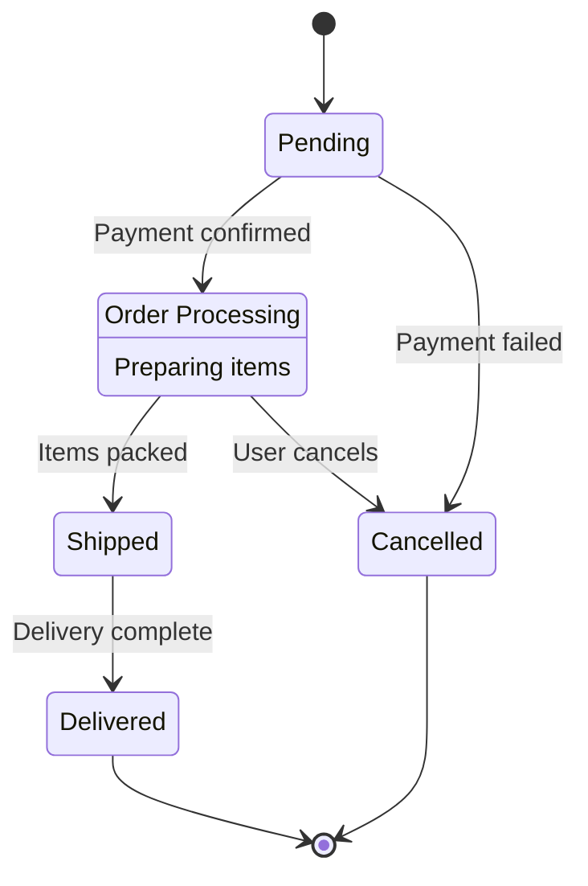

**Code:**
```
stateDiagram-v2
    [*] --> Pending
    Pending --> Processing : Payment confirmed
    Processing --> Shipped : Items packed
    Shipped --> Delivered : Delivery complete
    Processing --> Cancelled : User cancels
    Pending --> Cancelled : Payment failed
    Delivered --> [*]
    Cancelled --> [*]

    Processing: Order Processing
    Processing: Preparing items
```

### ER Diagram

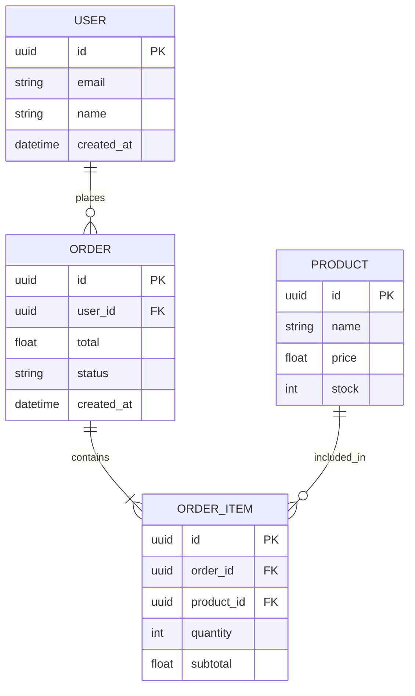

**Code:**
```
erDiagram
    USER ||--o{ ORDER : places
    ORDER ||--|{ ORDER_ITEM : contains
    PRODUCT ||--o{ ORDER_ITEM : included_in

    USER {
        uuid id PK
        string email
        string name
        datetime created_at
    }

    ORDER {
        uuid id PK
        uuid user_id FK
        float total
        string status
        datetime created_at
    }

    PRODUCT {
        uuid id PK
        string name
        float price
        int stock
    }

    ORDER_ITEM {
        uuid id PK
        uuid order_id FK
        uuid product_id FK
        int quantity
        float subtotal
    }
```

### Gantt Chart

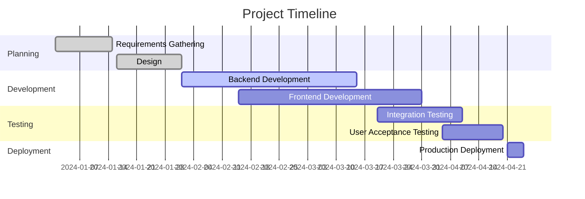

**Code:**
```
gantt
    title Project Timeline
    dateFormat YYYY-MM-DD
    section Planning
    Requirements Gathering    :done, req, 2024-01-01, 2024-01-15
    Design                     :done, design, 2024-01-16, 2024-02-01
    section Development
    Backend Development        :active, backend, 2024-02-01, 2024-03-15
    Frontend Development       :frontend, 2024-02-15, 2024-03-31
    section Testing
    Integration Testing        :testing, 2024-03-20, 2024-04-10
    User Acceptance Testing    :uat, 2024-04-05, 2024-04-20
    section Deployment
    Production Deployment      :deploy, 2024-04-21, 2024-04-25
```

### Mindmap

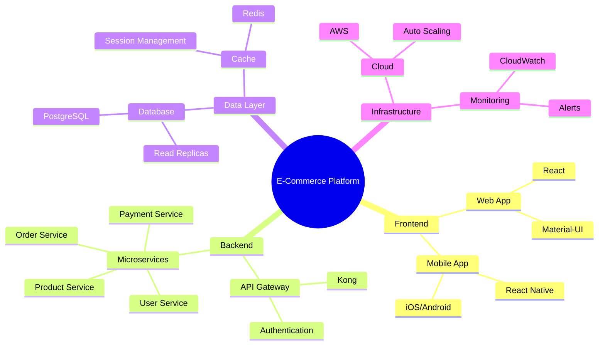

**Code:**
```
mindmap
    root((E-Commerce Platform))
        Frontend
            Web App
                React
                Material-UI
            Mobile App
                React Native
                iOS/Android
        Backend
            API Gateway
                Kong
                Authentication
            Microservices
                User Service
                Product Service
                Order Service
                Payment Service
        Data Layer
            Database
                PostgreSQL
                Read Replicas
            Cache
                Redis
                Session Management
        Infrastructure
            Cloud
                AWS
                Auto Scaling
            Monitoring
                CloudWatch
                Alerts
```

## PlantUML Diagrams

### Component Diagram

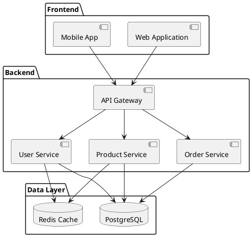

### Deployment Diagram

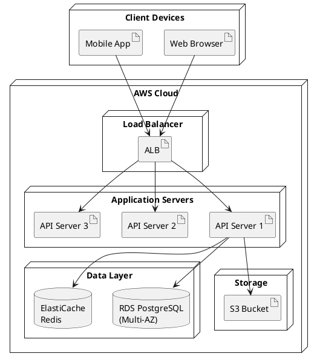

### Activity Diagram

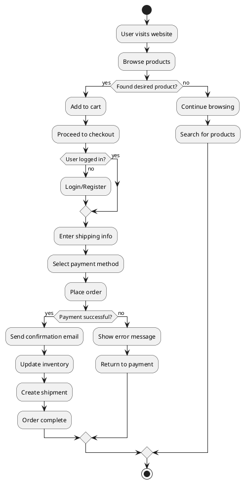

### Use Case Diagram

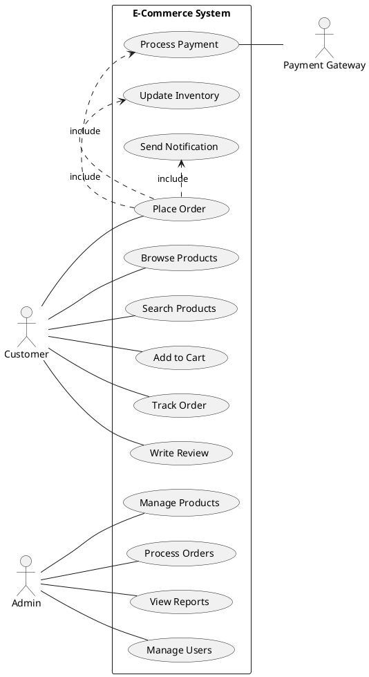

### C4 Model - System Context

```plantuml
@startuml
!include https://raw.githubusercontent.com/plantuml-stdlib/C4-PlantUML/master/C4_Context.puml

Person(customer, "Customer", "A user of the e-commerce platform")
Person(admin, "Administrator", "Manages the platform")

System(ecommerce, "E-Commerce Platform", "Allows customers to browse and purchase products")

System_Ext(payment, "Payment Gateway", "Processes payments")
System_Ext(shipping, "Shipping Provider", "Handles logistics")
System_Ext(email, "Email Service", "Sends notifications")

Rel(customer, ecommerce, "Browses products, places orders")
Rel(admin, ecommerce, "Manages products and orders")
Rel(ecommerce, payment, "Processes payments")
Rel(ecommerce, shipping, "Creates shipments")
Rel(ecommerce, email, "Sends emails")
@enduml
```

### C4 Model - Container Diagram

```plantuml
@startuml
!include https://raw.githubusercontent.com/plantuml-stdlib/C4-PlantUML/master/C4_Container.puml

Person(customer, "Customer")

System_Boundary(c1, "E-Commerce Platform") {
    Container(web, "Web Application", "React", "Provides UI for customers")
    Container(mobile, "Mobile App", "React Native", "Provides mobile UI")
    Container(api, "API Gateway", "Kong", "Routes requests to services")

    Container(userService, "User Service", "Node.js", "Manages user accounts")
    Container(productService, "Product Service", "Node.js", "Manages products")
    Container(orderService, "Order Service", "Node.js", "Handles orders")

    ContainerDb(db, "Database", "PostgreSQL", "Stores user and product data")
    ContainerDb(cache, "Cache", "Redis", "Caches frequently accessed data")
}

System_Ext(payment, "Payment Gateway")
System_Ext(email, "Email Service")

Rel(customer, web, "Uses", "HTTPS")
Rel(customer, mobile, "Uses", "HTTPS")

Rel(web, api, "Makes API calls", "HTTPS/JSON")
Rel(mobile, api, "Makes API calls", "HTTPS/JSON")

Rel(api, userService, "Routes to")
Rel(api, productService, "Routes to")
Rel(api, orderService, "Routes to")

Rel(userService, db, "Reads/Writes")
Rel(productService, db, "Reads/Writes")
Rel(orderService, db, "Reads/Writes")

Rel(userService, cache, "Reads/Writes")
Rel(productService, cache, "Reads/Writes")

Rel(orderService, payment, "Processes payments")
Rel(orderService, email, "Sends emails")
@enduml
```

## Generating Diagrams Programmatically

### Python with Mermaid

```python
def generate_flowchart(steps):
    """Generate Mermaid flowchart code"""
    mermaid_code = "flowchart TD\n"

    for i, step in enumerate(steps):
        node_id = f"    {chr(65 + i)}"  # A, B, C, ...
        mermaid_code += f"{node_id}[{step}]\n"

        if i < len(steps) - 1:
            next_node = chr(65 + i + 1)
            mermaid_code += f"    {chr(65 + i)} --> {next_node}\n"

    return mermaid_code

# Usage
steps = ["Start", "Collect Data", "Process Data", "Generate Report", "End"]
flowchart = generate_flowchart(steps)
print(flowchart)

# Save to file
with open('flowchart.md', 'w') as f:
    f.write(f"```mermaid\n{flowchart}\n```")
```

### Python with PlantUML

```python
def generate_sequence_diagram(interactions):
    """Generate PlantUML sequence diagram"""
    plantuml_code = "@startuml\n"

    for interaction in interactions:
        actor = interaction['from']
        target = interaction['to']
        message = interaction['message']
        plantuml_code += f"{actor} -> {target}: {message}\n"

    plantuml_code += "@enduml"
    return plantuml_code

# Usage
interactions = [
    {'from': 'User', 'to': 'System', 'message': 'Login request'},
    {'from': 'System', 'to': 'Database', 'message': 'Verify credentials'},
    {'from': 'Database', 'to': 'System', 'message': 'User data'},
    {'from': 'System', 'to': 'User', 'message': 'Login successful'}
]

diagram = generate_sequence_diagram(interactions)
print(diagram)
```

### Auto-Generate from JSON

```python
import json

def generate_er_diagram_from_json(schema_file):
    """Generate Mermaid ER diagram from JSON schema"""
    with open(schema_file, 'r') as f:
        schema = json.load(f)

    mermaid_code = "erDiagram\n"

    # Add relationships
    for entity in schema['entities']:
        for rel in entity.get('relationships', []):
            mermaid_code += f"    {entity['name']} {rel['cardinality']} {rel['target']} : {rel['name']}\n"

    mermaid_code += "\n"

    # Add entity definitions
    for entity in schema['entities']:
        mermaid_code += f"    {entity['name']} {{\n"
        for field in entity['fields']:
            mermaid_code += f"        {field['type']} {field['name']}"
            if field.get('isPrimaryKey'):
                mermaid_code += " PK"
            if field.get('isForeignKey'):
                mermaid_code += " FK"
            mermaid_code += "\n"
        mermaid_code += "    }\n\n"

    return mermaid_code

# Example JSON schema
schema = {
    "entities": [
        {
            "name": "USER",
            "fields": [
                {"name": "id", "type": "uuid", "isPrimaryKey": True},
                {"name": "email", "type": "string"},
                {"name": "name", "type": "string"}
            ],
            "relationships": [
                {"name": "places", "target": "ORDER", "cardinality": "||--o{"}
            ]
        },
        {
            "name": "ORDER",
            "fields": [
                {"name": "id", "type": "uuid", "isPrimaryKey": True},
                {"name": "user_id", "type": "uuid", "isForeignKey": True},
                {"name": "total", "type": "float"}
            ],
            "relationships": []
        }
    ]
}

# Save and generate
with open('schema.json', 'w') as f:
    json.dump(schema, f)

er_diagram = generate_er_diagram_from_json('schema.json')
print(er_diagram)
```

## Rendering Diagrams

### Mermaid Rendering

**Option 1: GitHub/GitLab**
```markdown
# Documentation

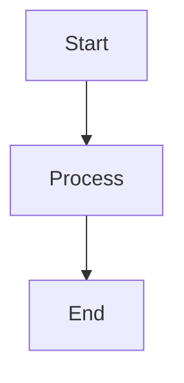
```

**Option 2: Mermaid CLI**
```bash
# Install
npm install -g @mermaid-js/mermaid-cli

# Render to PNG
mmdc -i diagram.mmd -o diagram.png

# Render to SVG
mmdc -i diagram.mmd -o diagram.svg
```

**Option 3: Mermaid Live Editor**
- Visit: https://mermaid.live
- Paste code and export

### PlantUML Rendering

**Option 1: PlantUML CLI**
```bash
# Install (requires Java)
# Download plantuml.jar

# Render to PNG
java -jar plantuml.jar diagram.puml

# Render to SVG
java -jar plantuml.jar -tsvg diagram.puml
```

**Option 2: PlantUML Online Server**
```python
import requests
import zlib
import base64

def render_plantuml(code, output_file='diagram.png'):
    """Render PlantUML code using online server"""
    # Encode
    compressed = zlib.compress(code.encode('utf-8'))
    encoded = base64.b64encode(compressed).decode('utf-8')

    # Request
    url = f"http://www.plantuml.com/plantuml/png/{encoded}"
    response = requests.get(url)

    # Save
    with open(output_file, 'wb') as f:
        f.write(response.content)

# Usage
plantuml_code = """
@startuml
Alice -> Bob: Hello
Bob -> Alice: Hi!
@enduml
"""

render_plantuml(plantuml_code, 'sequence.png')
```

## Best Practices

### Diagram Design
- Keep diagrams simple and focused
- Use consistent notation and styling
- Include legends for complex diagrams
- Limit elements per diagram (max 10-15)
- Use meaningful labels and names

### Mermaid Best Practices
- Use descriptive node IDs
- Apply consistent styling
- Group related elements
- Use subgraphs for organization
- Include direction for flowcharts (TD, LR, etc.)

### PlantUML Best Practices
- Follow UML standards
- Use skinparams for styling
- Include stereotypes when appropriate
- Group related elements in packages
- Use notes for additional context

### Documentation Integration
- Store diagrams as code in version control
- Generate diagrams as part of CI/CD
- Include diagrams in technical documentation
- Keep diagrams up-to-date with code
- Use diagrams in presentations

## Quick Reference

### Mermaid Diagram Types

| Type | Keyword | Use Case |
|------|---------|----------|
| Flowchart | `flowchart` | Process flows |
| Sequence | `sequenceDiagram` | Interactions |
| Class | `classDiagram` | Object models |
| State | `stateDiagram-v2` | State machines |
| ER | `erDiagram` | Database schemas |
| Gantt | `gantt` | Project timelines |
| Mindmap | `mindmap` | Concept mapping |

### PlantUML Diagram Types

| Type | Tag | Use Case |
|------|-----|----------|
| Use Case | `@startuml` | User interactions |
| Class | `@startuml` | Object-oriented design |
| Component | `@startuml` | System components |
| Deployment | `@startuml` | Infrastructure |
| Sequence | `@startuml` | Message flows |
| Activity | `@startuml` | Business processes |
| State | `@startuml` | State transitions |

### Common Shapes and Notations

**Mermaid Flowchart Shapes:**
```
[Rectangle]        - Process
([Stadium])        - Start/End
{Diamond}          - Decision
{{Hexagon}}        - Preparation
[(Database)]       - Database
((Circle))         - Connection point
```

**PlantUML Connectors:**
```
-->   Arrow
..>   Dotted arrow
-     Line
..    Dotted line
--    Bold line
```

## Keywords

**English keywords:**
chart generator, diagram generator, flowchart, sequence diagram, uml diagram, mermaid diagram, plantuml, architecture diagram, er diagram, class diagram, state diagram, mindmap, gantt chart

**Chinese keywords (中文關鍵詞):**
圖表生成, 流程圖, 時序圖, UML圖, Mermaid圖表, PlantUML, 架構圖, 實體關係圖, 類圖, 狀態圖, 思維導圖, 甘特圖
