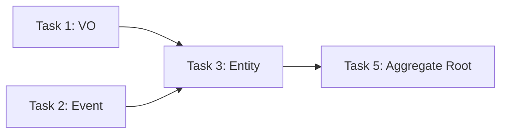

# Implementation Plan Output Template

> Phase 4 structured output format. Read when producing implementation plan deliverables.

## Per-File Task Specification Format

```markdown
### Task [編號]: [任務名稱]

**檔案**: `src/main/java/com/example/[path]/[FileName].java`
**類型**: [Test | Implementation | Migration | Config]
**依賴**: Task [N], Task [M]
**對應測試**: Task [N] (若為 Implementation 類型)

#### 目的
[一句話說明這個檔案的職責]

#### 規格
- [具體實作要點 1]
- [具體實作要點 2]
- [具體實作要點 3]

#### 介面定義
```java
// 類別簽章、方法簽章（不含實作）
public class ClassName {
    public ReturnType methodName(ParamType param);
}
```

#### 測試案例 (若為 Test 類型)
- [ ] [測試情境 1]: Given [前置條件], When [動作], Then [預期結果]
- [ ] [測試情境 2]: Given [前置條件], When [動作], Then [預期結果]

#### 驗收標準
- [ ] [檢查項目 1]
- [ ] [檢查項目 2]
```

## Full Plan Document Template

```markdown
# 實作計畫: [功能名稱]

## 概覽
- **涉及聚合**: [聚合名稱列表]
- **總任務數**: N 個（測試 X 個 + 實作 Y 個 + 遷移 Z 個）
- **預估檔案數**: N 個

## 依賴圖



> For plans with 20+ tasks, group nodes by Phase (subgraph) for readability.

## 任務清單

### Phase 1: Domain Layer

#### Task 1: [Test] OrderId 值對象測試
**檔案**: `src/test/java/.../domain/OrderIdTest.java`
**類型**: Test
**依賴**: 無
...

#### Task 2: [Impl] OrderId 值對象
**檔案**: `src/main/java/.../domain/OrderId.java`
**類型**: Implementation
**對應測試**: Task 1
...
```

## Task Decomposition Order (per Aggregate)

```
Phase 1: Domain Layer
  1.1 Value Object
  1.2 Domain Event
  1.3 Entity
  1.4 Aggregate Root (with invariants)
  1.5 Repository Interface
  1.6 Domain Service (if needed)

Phase 2: Application Layer
  2.1 Command / DTO definitions
  2.2 Application Service
  2.3 Event Handler (if needed)

Phase 3: Infrastructure Layer
  3.1 JPA Entity Mapping (if Domain Entity != JPA Entity)
  3.2 Repository Implementation
  3.3 DB Migration Script (Flyway)

Phase 4: Presentation Layer
  4.1 REST Controller
  4.2 Request/Response DTO
  4.3 Exception Handler / Error Mapping

Phase 5: Frontend
  5.1 API Client / Composable
  5.2 Store (Pinia)
  5.3 Component
  5.4 Page / Route
```

## Key Rules

- Every Implementation task MUST have a corresponding Test task before it
- Migration scripts come after all Domain tasks, before Repository implementations
- Frontend tasks come after all backend API tasks are complete
- If SD design has gaps, proactively flag them and suggest additions
