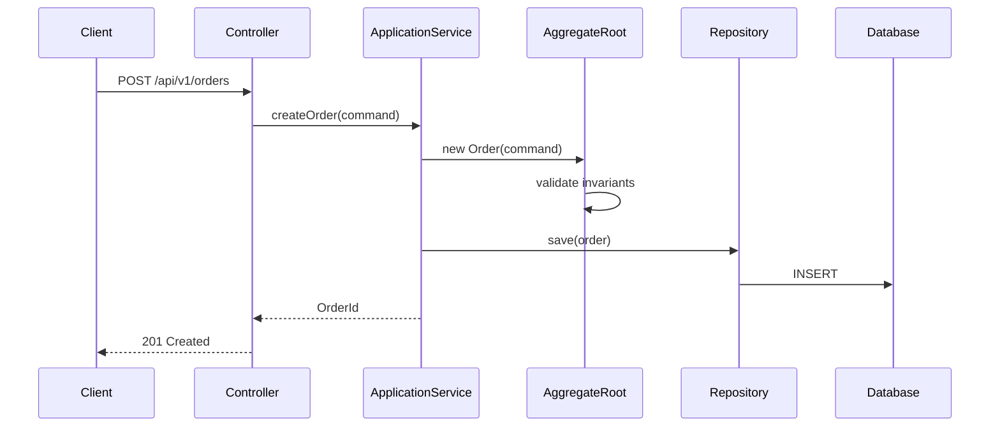

# SD Tactical Design Output Template

> Phase 3 structured output format. Read when producing SD deliverables.

## Full Document Template

```markdown
# 系統設計文件: [功能/上下文名稱]

## 1. 設計概覽
- **限界上下文**: [Context 名稱]
- **涉及聚合**: [聚合列表]
- **API 端點數**: N 個
- **技術棧**: Spring Boot 3.x + JPA + PostgreSQL

## 2. 聚合結構設計
[各聚合的內部結構]

## 3. API 規格
[RESTful API 規格]

## 4. 套件結構
[套件佈局]

## 5. 介面定義
[Repository、Service 介面]

## 6. 序列圖
[關鍵流程序列圖]

## 7. DTO 定義
[Command、Query、Response DTO]

## 8. 錯誤處理
[錯誤碼定義和例外處理策略]

## 9. 設計決策記錄 (ADR)
[重要的設計決策和理由]
```

## Standard Package Layout (Spring Boot + JPA + DDD)

```
src/main/java/com/example/[project]/
├── [context]/                          # 限界上下文
│   ├── domain/                         # 領域層
│   │   ├── model/                      # 聚合、Entity、VO
│   │   │   ├── [AggregateRoot].java
│   │   │   ├── [InternalEntity].java
│   │   │   ├── [ValueObject].java
│   │   │   └── [AggregateRootId].java
│   │   ├── event/                      # 領域事件
│   │   │   └── [DomainEvent].java
│   │   ├── repository/                 # 倉儲介面
│   │   │   └── [AggregateRoot]Repository.java
│   │   └── service/                    # 領域服務（跨聚合邏輯）
│   │       └── [DomainService].java
│   │
│   ├── application/                    # 應用層
│   │   ├── command/                    # 命令 DTO
│   │   │   └── [Command]Command.java
│   │   ├── query/                      # 查詢 DTO
│   │   │   └── [Query]Query.java
│   │   ├── dto/                        # 回應 DTO
│   │   │   └── [Response]Response.java
│   │   ├── service/                    # 應用服務
│   │   │   └── [AggregateRoot]ApplicationService.java
│   │   └── eventhandler/              # 事件處理器
│   │       └── [Event]Handler.java
│   │
│   ├── infrastructure/                 # 基礎設施層
│   │   ├── persistence/                # JPA 實作
│   │   │   ├── Jpa[AggregateRoot]Repository.java
│   │   │   └── SpringData[AggregateRoot]Repository.java
│   │   └── adapter/                    # 外部系統適配器
│   │       └── [ExternalSystem]Adapter.java
│   │
│   └── interfaces/                     # 介面層（展示層）
│       ├── rest/                       # REST Controller
│       │   └── [AggregateRoot]Controller.java
│       └── dto/                        # Request/Response 轉換
│           ├── [Request]Request.java
│           └── [Assembler].java
│
└── shared/                             # 共享核心
    ├── domain/                         # 共用 Value Object
    │   ├── Money.java
    │   └── AuditInfo.java
    └── infrastructure/                 # 共用基礎設施
        └── exception/
            └── GlobalExceptionHandler.java
```

## Aggregate Structure Format

For each aggregate, produce:

```markdown
## 聚合設計: [聚合名稱]

### 聚合根: [AggregateRoot 名稱]
```java
@Entity
@Table(name = "table_name")
public class AggregateRoot {
    @EmbeddedId
    private AggregateRootId id;

    @OneToMany(cascade = CascadeType.ALL, orphanRemoval = true)
    private List<InternalEntity> items;

    @Embedded
    private SomeValueObject valueObject;

    @Enumerated(EnumType.STRING)
    private Status status;

    // === Command methods ===
    public void commandMethod(Param param) {
        // invariant checks
        // state changes
        // register domain events
    }
}
```

### 不變條件 (Invariants)
1. [Invariant 1]: enforced in [method]
2. [Invariant 2]: enforced in [method]

### 領域事件
- `EventName`: produced in [method], carries [data]
```

## API Specification Format

```markdown
## API 規格: [聚合名稱]

### 基礎路徑: `/api/v1/[aggregate-roots]`

#### POST /api/v1/[aggregate-roots]
**對應命令**: Create[AggregateRoot]Command
**Request Body**: ```json { ... } ```
**Response 201**: ```json { ... } ```
**驗證規則**: [field constraints]
**錯誤回應**: 400 validation / 409 business rule conflict

#### PATCH /api/v1/[aggregate-roots]/{id}/[action]
**對應命令**: [Action]Command
...
```

## Interface Definition Format

```markdown
### Repository 介面
```java
public interface OrderRepository {
    Order findById(OrderId id);
    Optional<Order> findByIdOptional(OrderId id);
    void save(Order order);
    void delete(Order order);
    Page<Order> findAll(SearchCriteria criteria, Pageable pageable);
}
```

### Application Service
```java
@Service
public class OrderApplicationService {
    @Transactional
    public OrderId createOrder(CreateOrderCommand command);

    @Transactional(readOnly = true)
    public OrderDetailResponse findById(OrderId id);
}
```
```

## Sequence Diagram Format (Mermaid)


