# 圖表與圖形產生器

## 概述

此技能提供使用 Mermaid 和 PlantUML 建立專業圖表與圖形的完整指南。涵蓋流程圖（Flowchart）、時序圖（Sequence Diagram）、類別圖（Class Diagram）、架構圖（Architecture Diagram）、ER 圖（Entity-Relationship Diagram）、狀態機（State Machine）、心智圖（Mindmap）以及各種其他用於技術文件的圖表類型。

## 何時使用此技能

**當使用者提及以下內容時，務必使用此技能：**
- 建立流程圖或流程圖表
- 產生 UML 圖
- 建立時序圖
- 建構架構圖
- 建立 ER 圖或資料庫綱要（Database Schema）
- 產生類別圖
- 建立狀態圖
- 建構心智圖或時間軸

**觸發詞彙包括：**
- "Create flowchart" / "建立流程圖"
- "Generate diagram" / "生成圖表"
- "Draw sequence diagram" / "畫時序圖"
- "Architecture diagram" / "架構圖"
- "UML diagram" / "UML圖"
- "ER diagram" / "實體關係圖"
- "Class diagram" / "類圖"
- "State diagram" / "狀態圖"

## 如何使用此技能

### 工作流程概述

此技能遵循系統化的三步驟工作流程：

1. **辨識圖表類型** - 根據使用情境判斷適合的圖表類型
2. **選擇工具** - 依據需求選擇 Mermaid 或 PlantUML
3. **產生圖表** - 建立圖表程式碼並進行渲染

## Mermaid 與 PlantUML 比較

### 何時使用 Mermaid
- 適用於 Markdown 的圖表
- 快速、簡單的圖表
- GitHub/GitLab 文件
- 基於網頁的渲染
- 流程圖、時序圖、甘特圖（Gantt Chart）

### 何時使用 PlantUML
- 複雜的 UML 圖
- 詳細的系統架構
- 符合 UML 標準規範
- 進階樣式需求
- 企業級文件

## Mermaid 圖表

### 流程圖（Flowchart）

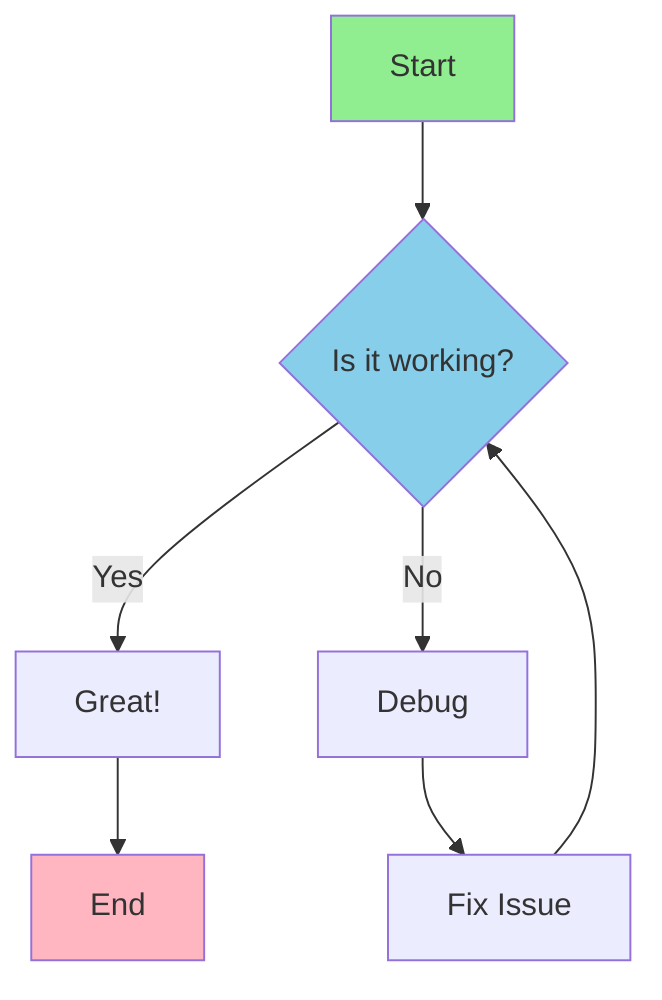

**程式碼：**
```
flowchart TD
    A[Start] --> B{Is it working?}
    B -->|Yes| C[Great!]
    B -->|No| D[Debug]
    D --> E[Fix Issue]
    E --> B
    C --> F[End]

    style A fill:#90EE90
    style F fill:#FFB6C1
    style B fill:#87CEEB
```

### 時序圖（Sequence Diagram）

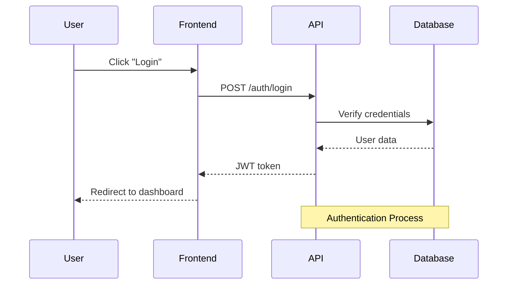

**程式碼：**
```
sequenceDiagram
    participant User
    participant Frontend
    participant API
    participant Database

    User->>Frontend: Click "Login"
    Frontend->>API: POST /auth/login
    API->>Database: Verify credentials
    Database-->>API: User data
    API-->>Frontend: JWT token
    Frontend-->>User: Redirect to dashboard

    Note over API,Database: Authentication Process
```

### 類別圖（Class Diagram）

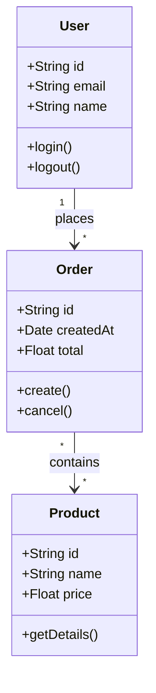

**程式碼：**
```
classDiagram
    class User {
        +String id
        +String email
        +String name
        +login()
        +logout()
    }

    class Order {
        +String id
        +Date createdAt
        +Float total
        +create()
        +cancel()
    }

    class Product {
        +String id
        +String name
        +Float price
        +getDetails()
    }

    User "1" --> "*" Order : places
    Order "*" --> "*" Product : contains
```

### 狀態圖（State Diagram）

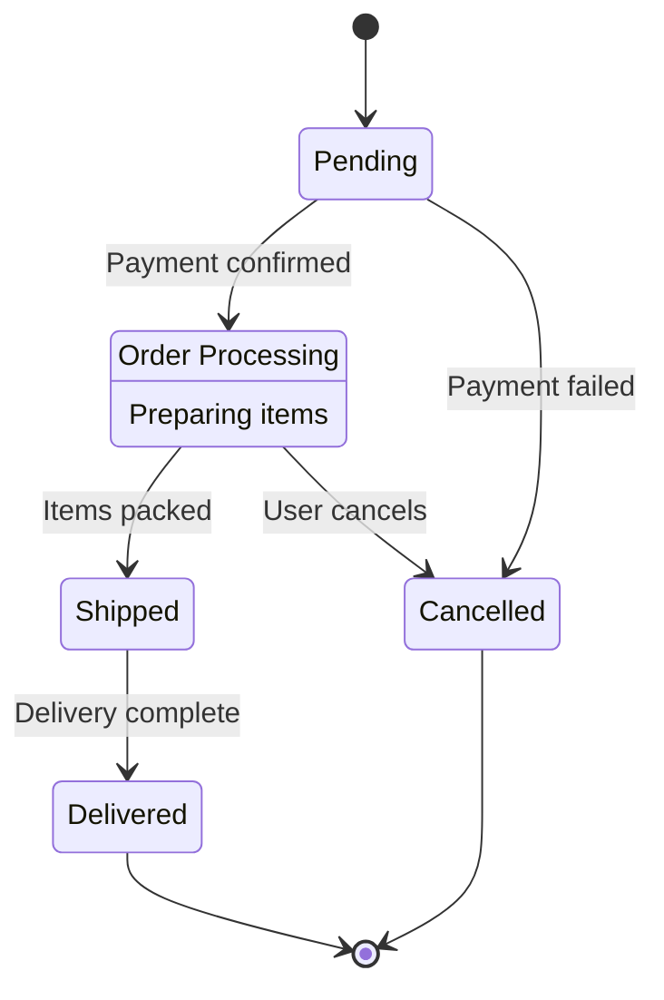

**程式碼：**
```
stateDiagram-v2
    [*] --> Pending
    Pending --> Processing : Payment confirmed
    Processing --> Shipped : Items packed
    Shipped --> Delivered : Delivery complete
    Processing --> Cancelled : User cancels
    Pending --> Cancelled : Payment failed
    Delivered --> [*]
    Cancelled --> [*]

    Processing: Order Processing
    Processing: Preparing items
```

### ER 圖（Entity-Relationship Diagram）

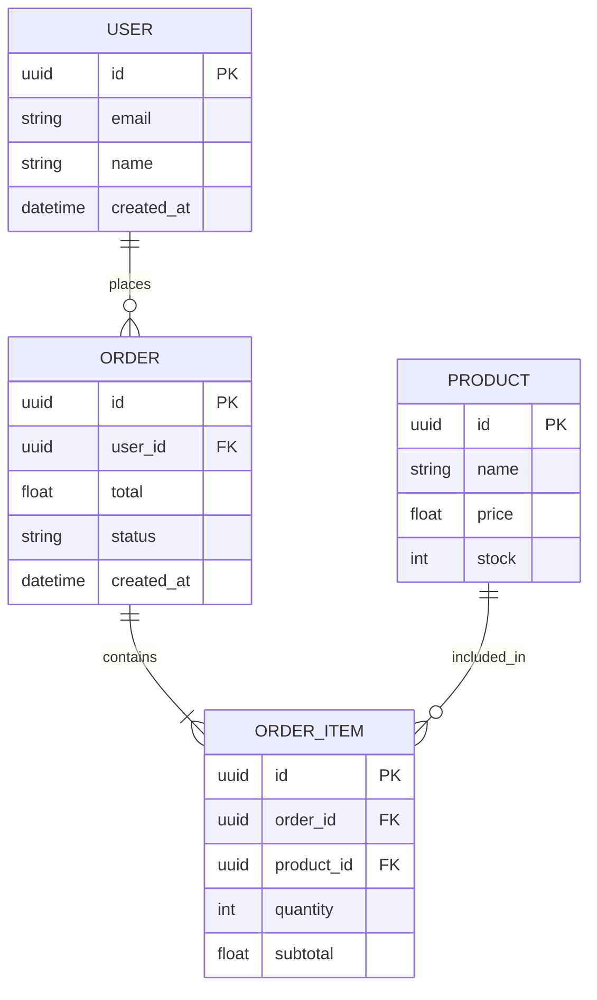

**程式碼：**
```
erDiagram
    USER ||--o{ ORDER : places
    ORDER ||--|{ ORDER_ITEM : contains
    PRODUCT ||--o{ ORDER_ITEM : included_in

    USER {
        uuid id PK
        string email
        string name
        datetime created_at
    }

    ORDER {
        uuid id PK
        uuid user_id FK
        float total
        string status
        datetime created_at
    }

    PRODUCT {
        uuid id PK
        string name
        float price
        int stock
    }

    ORDER_ITEM {
        uuid id PK
        uuid order_id FK
        uuid product_id FK
        int quantity
        float subtotal
    }
```

### 甘特圖（Gantt Chart）

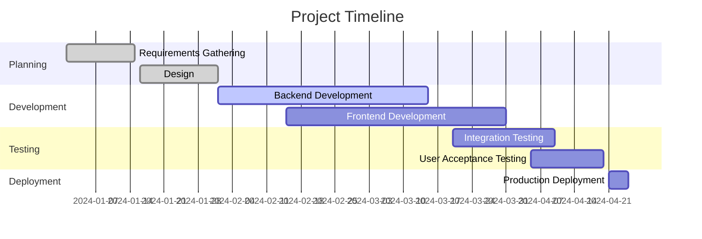

**程式碼：**
```
gantt
    title Project Timeline
    dateFormat YYYY-MM-DD
    section Planning
    Requirements Gathering    :done, req, 2024-01-01, 2024-01-15
    Design                     :done, design, 2024-01-16, 2024-02-01
    section Development
    Backend Development        :active, backend, 2024-02-01, 2024-03-15
    Frontend Development       :frontend, 2024-02-15, 2024-03-31
    section Testing
    Integration Testing        :testing, 2024-03-20, 2024-04-10
    User Acceptance Testing    :uat, 2024-04-05, 2024-04-20
    section Deployment
    Production Deployment      :deploy, 2024-04-21, 2024-04-25
```

### 心智圖（Mindmap）

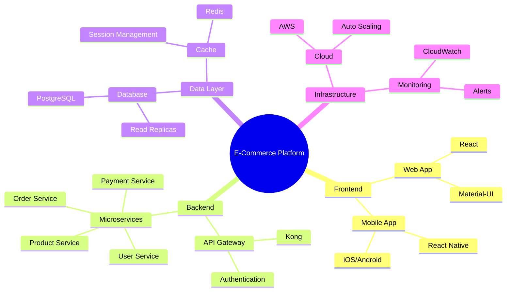

**程式碼：**
```
mindmap
    root((E-Commerce Platform))
        Frontend
            Web App
                React
                Material-UI
            Mobile App
                React Native
                iOS/Android
        Backend
            API Gateway
                Kong
                Authentication
            Microservices
                User Service
                Product Service
                Order Service
                Payment Service
        Data Layer
            Database
                PostgreSQL
                Read Replicas
            Cache
                Redis
                Session Management
        Infrastructure
            Cloud
                AWS
                Auto Scaling
            Monitoring
                CloudWatch
                Alerts
```

## PlantUML 圖表

### 元件圖（Component Diagram）

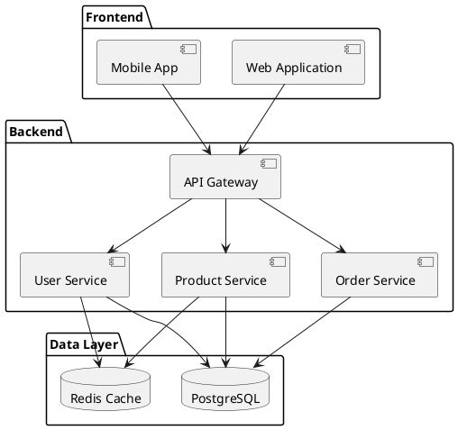

### 部署圖（Deployment Diagram）

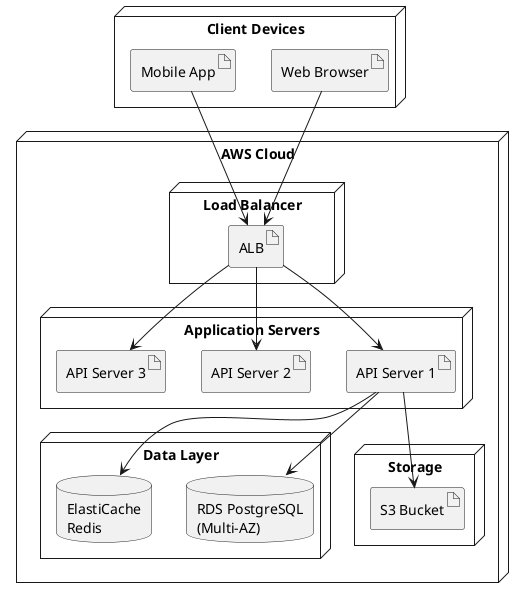

### 活動圖（Activity Diagram）

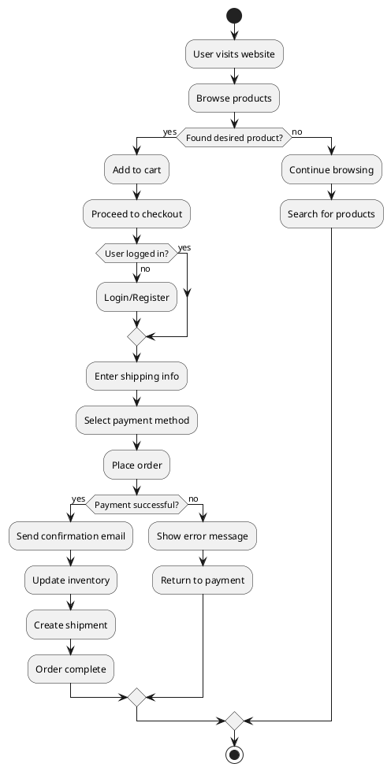

### 使用案例圖（Use Case Diagram）

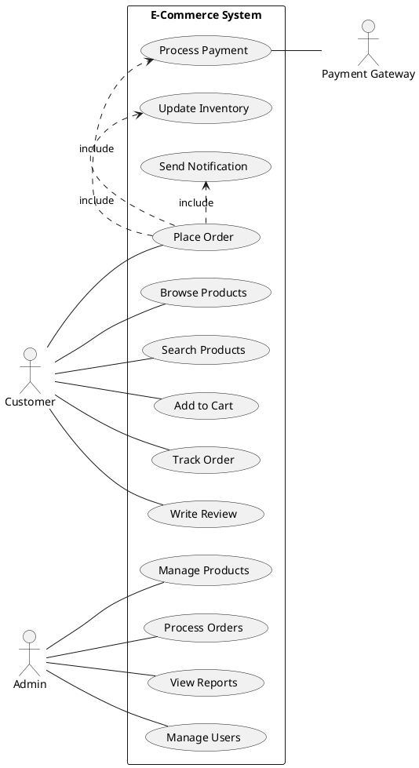

### C4 模型 - 系統情境圖（System Context）

```plantuml
@startuml
!include https://raw.githubusercontent.com/plantuml-stdlib/C4-PlantUML/master/C4_Context.puml

Person(customer, "Customer", "A user of the e-commerce platform")
Person(admin, "Administrator", "Manages the platform")

System(ecommerce, "E-Commerce Platform", "Allows customers to browse and purchase products")

System_Ext(payment, "Payment Gateway", "Processes payments")
System_Ext(shipping, "Shipping Provider", "Handles logistics")
System_Ext(email, "Email Service", "Sends notifications")

Rel(customer, ecommerce, "Browses products, places orders")
Rel(admin, ecommerce, "Manages products and orders")
Rel(ecommerce, payment, "Processes payments")
Rel(ecommerce, shipping, "Creates shipments")
Rel(ecommerce, email, "Sends emails")
@enduml
```

### C4 模型 - 容器圖（Container Diagram）

```plantuml
@startuml
!include https://raw.githubusercontent.com/plantuml-stdlib/C4-PlantUML/master/C4_Container.puml

Person(customer, "Customer")

System_Boundary(c1, "E-Commerce Platform") {
    Container(web, "Web Application", "React", "Provides UI for customers")
    Container(mobile, "Mobile App", "React Native", "Provides mobile UI")
    Container(api, "API Gateway", "Kong", "Routes requests to services")

    Container(userService, "User Service", "Node.js", "Manages user accounts")
    Container(productService, "Product Service", "Node.js", "Manages products")
    Container(orderService, "Order Service", "Node.js", "Handles orders")

    ContainerDb(db, "Database", "PostgreSQL", "Stores user and product data")
    ContainerDb(cache, "Cache", "Redis", "Caches frequently accessed data")
}

System_Ext(payment, "Payment Gateway")
System_Ext(email, "Email Service")

Rel(customer, web, "Uses", "HTTPS")
Rel(customer, mobile, "Uses", "HTTPS")

Rel(web, api, "Makes API calls", "HTTPS/JSON")
Rel(mobile, api, "Makes API calls", "HTTPS/JSON")

Rel(api, userService, "Routes to")
Rel(api, productService, "Routes to")
Rel(api, orderService, "Routes to")

Rel(userService, db, "Reads/Writes")
Rel(productService, db, "Reads/Writes")
Rel(orderService, db, "Reads/Writes")

Rel(userService, cache, "Reads/Writes")
Rel(productService, cache, "Reads/Writes")

Rel(orderService, payment, "Processes payments")
Rel(orderService, email, "Sends emails")
@enduml
```

## 以程式方式產生圖表

### 使用 Python 搭配 Mermaid

```python
def generate_flowchart(steps):
    """Generate Mermaid flowchart code"""
    mermaid_code = "flowchart TD\n"

    for i, step in enumerate(steps):
        node_id = f"    {chr(65 + i)}"  # A, B, C, ...
        mermaid_code += f"{node_id}[{step}]\n"

        if i < len(steps) - 1:
            next_node = chr(65 + i + 1)
            mermaid_code += f"    {chr(65 + i)} --> {next_node}\n"

    return mermaid_code

# Usage
steps = ["Start", "Collect Data", "Process Data", "Generate Report", "End"]
flowchart = generate_flowchart(steps)
print(flowchart)

# Save to file
with open('flowchart.md', 'w') as f:
    f.write(f"```mermaid\n{flowchart}\n```")
```

### 使用 Python 搭配 PlantUML

```python
def generate_sequence_diagram(interactions):
    """Generate PlantUML sequence diagram"""
    plantuml_code = "@startuml\n"

    for interaction in interactions:
        actor = interaction['from']
        target = interaction['to']
        message = interaction['message']
        plantuml_code += f"{actor} -> {target}: {message}\n"

    plantuml_code += "@enduml"
    return plantuml_code

# Usage
interactions = [
    {'from': 'User', 'to': 'System', 'message': 'Login request'},
    {'from': 'System', 'to': 'Database', 'message': 'Verify credentials'},
    {'from': 'Database', 'to': 'System', 'message': 'User data'},
    {'from': 'System', 'to': 'User', 'message': 'Login successful'}
]

diagram = generate_sequence_diagram(interactions)
print(diagram)
```

### 從 JSON 自動產生

```python
import json

def generate_er_diagram_from_json(schema_file):
    """Generate Mermaid ER diagram from JSON schema"""
    with open(schema_file, 'r') as f:
        schema = json.load(f)

    mermaid_code = "erDiagram\n"

    # Add relationships
    for entity in schema['entities']:
        for rel in entity.get('relationships', []):
            mermaid_code += f"    {entity['name']} {rel['cardinality']} {rel['target']} : {rel['name']}\n"

    mermaid_code += "\n"

    # Add entity definitions
    for entity in schema['entities']:
        mermaid_code += f"    {entity['name']} {{\n"
        for field in entity['fields']:
            mermaid_code += f"        {field['type']} {field['name']}"
            if field.get('isPrimaryKey'):
                mermaid_code += " PK"
            if field.get('isForeignKey'):
                mermaid_code += " FK"
            mermaid_code += "\n"
        mermaid_code += "    }\n\n"

    return mermaid_code

# Example JSON schema
schema = {
    "entities": [
        {
            "name": "USER",
            "fields": [
                {"name": "id", "type": "uuid", "isPrimaryKey": True},
                {"name": "email", "type": "string"},
                {"name": "name", "type": "string"}
            ],
            "relationships": [
                {"name": "places", "target": "ORDER", "cardinality": "||--o{"}
            ]
        },
        {
            "name": "ORDER",
            "fields": [
                {"name": "id", "type": "uuid", "isPrimaryKey": True},
                {"name": "user_id", "type": "uuid", "isForeignKey": True},
                {"name": "total", "type": "float"}
            ],
            "relationships": []
        }
    ]
}

# Save and generate
with open('schema.json', 'w') as f:
    json.dump(schema, f)

er_diagram = generate_er_diagram_from_json('schema.json')
print(er_diagram)
```

## 渲染圖表

### Mermaid 渲染方式

**方式一：GitHub/GitLab**
```markdown
# Documentation

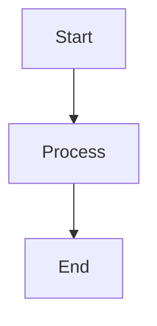
```

**方式二：Mermaid CLI**
```bash
# Install
npm install -g @mermaid-js/mermaid-cli

# Render to PNG
mmdc -i diagram.mmd -o diagram.png

# Render to SVG
mmdc -i diagram.mmd -o diagram.svg
```

**方式三：Mermaid 線上編輯器**
- 網址：https://mermaid.live
- 貼上程式碼即可匯出

### PlantUML 渲染方式

**方式一：PlantUML CLI**
```bash
# Install (requires Java)
# Download plantuml.jar

# Render to PNG
java -jar plantuml.jar diagram.puml

# Render to SVG
java -jar plantuml.jar -tsvg diagram.puml
```

**方式二：PlantUML 線上伺服器**
```python
import requests
import zlib
import base64

def render_plantuml(code, output_file='diagram.png'):
    """Render PlantUML code using online server"""
    # Encode
    compressed = zlib.compress(code.encode('utf-8'))
    encoded = base64.b64encode(compressed).decode('utf-8')

    # Request
    url = f"http://www.plantuml.com/plantuml/png/{encoded}"
    response = requests.get(url)

    # Save
    with open(output_file, 'wb') as f:
        f.write(response.content)

# Usage
plantuml_code = """
@startuml
Alice -> Bob: Hello
Bob -> Alice: Hi!
@enduml
"""

render_plantuml(plantuml_code, 'sequence.png')
```

## 最佳實踐

### 圖表設計
- 保持圖表簡潔且聚焦
- 使用一致的標記法和樣式
- 為複雜圖表加上圖例說明
- 限制每張圖表的元素數量（最多 10-15 個）
- 使用有意義的標籤和名稱

### Mermaid 最佳實踐
- 使用具描述性的節點 ID
- 套用一致的樣式
- 將相關元素分組
- 使用子圖（subgraph）進行組織
- 為流程圖加上方向指示（TD、LR 等）

### PlantUML 最佳實踐
- 遵循 UML 標準
- 使用 skinparam 進行樣式設定
- 適當時加入構造型（stereotype）
- 將相關元素以 package 分組
- 使用 note 補充額外說明

### 文件整合
- 將圖表以程式碼形式存放於版本控制系統中
- 在 CI/CD 流程中自動產生圖表
- 將圖表納入技術文件
- 保持圖表與程式碼同步更新
- 在簡報中使用圖表

## 快速參考

### Mermaid 圖表類型

| 類型 | 關鍵字 | 用途 |
|------|---------|----------|
| 流程圖（Flowchart） | `flowchart` | 流程展示 |
| 時序圖（Sequence） | `sequenceDiagram` | 互動關係 |
| 類別圖（Class） | `classDiagram` | 物件模型 |
| 狀態圖（State） | `stateDiagram-v2` | 狀態機 |
| ER 圖 | `erDiagram` | 資料庫綱要 |
| 甘特圖（Gantt） | `gantt` | 專案時間軸 |
| 心智圖（Mindmap） | `mindmap` | 概念對映 |

### PlantUML 圖表類型

| 類型 | 標籤 | 用途 |
|------|-----|----------|
| 使用案例圖（Use Case） | `@startuml` | 使用者互動 |
| 類別圖（Class） | `@startuml` | 物件導向設計 |
| 元件圖（Component） | `@startuml` | 系統元件 |
| 部署圖（Deployment） | `@startuml` | 基礎設施 |
| 時序圖（Sequence） | `@startuml` | 訊息流程 |
| 活動圖（Activity） | `@startuml` | 業務流程 |
| 狀態圖（State） | `@startuml` | 狀態轉換 |

### 常用圖形與標記

**Mermaid 流程圖圖形：**
```
[Rectangle]        - Process
([Stadium])        - Start/End
{Diamond}          - Decision
{{Hexagon}}        - Preparation
[(Database)]       - Database
((Circle))         - Connection point
```

**PlantUML 連接線：**
```
-->   Arrow
..>   Dotted arrow
-     Line
..    Dotted line
--    Bold line
```

## 關鍵字

**英文關鍵字：**
chart generator, diagram generator, flowchart, sequence diagram, uml diagram, mermaid diagram, plantuml, architecture diagram, er diagram, class diagram, state diagram, mindmap, gantt chart

**中文關鍵詞：**
圖表生成, 流程圖, 時序圖, UML圖, Mermaid圖表, PlantUML, 架構圖, 實體關係圖, 類圖, 狀態圖, 思維導圖, 甘特圖
